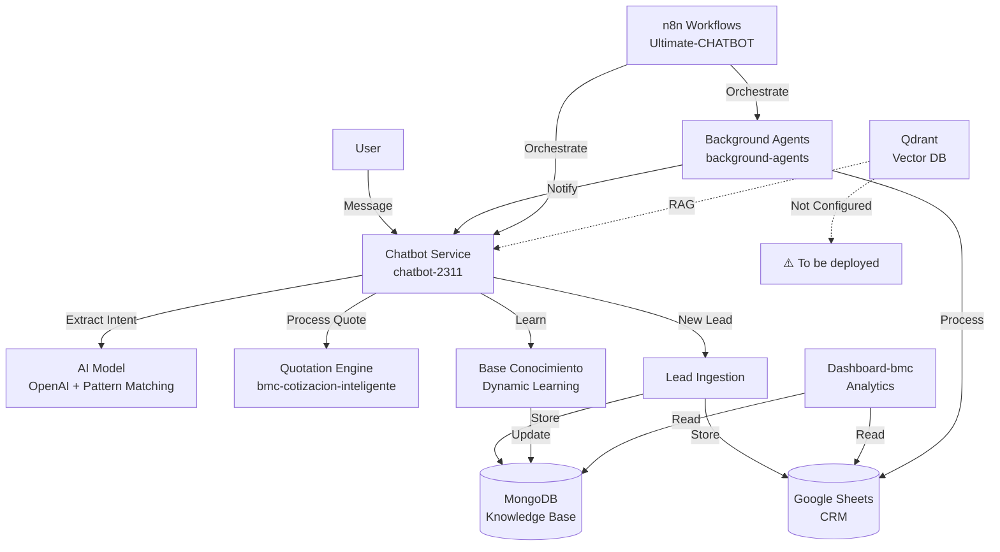

# 🏗 System Architecture Report: BMC Chatbot CRM Platform

**Date:** 2024-12-28  
**Analysis Type:** Comprehensive Ecosystem Analysis  
**Organization:** `matiasportugau-ui`  
**Analyst:** AI Architect (Master Prompt Execution)

---

## 📊 Executive Summary

### Tech Stack Profile

**Primary Technologies:**
- **Backend:** Python (FastAPI), TypeScript/JavaScript (Node.js)
- **Frontend:** Next.js, React, HTML/CSS
- **AI/NLP:** OpenAI GPT-4, Rasa 3.x, Pattern Matching
- **Orchestration:** n8n Workflows
- **Databases:** MongoDB, PostgreSQL, Qdrant (Vector DB)
- **Integrations:** WhatsApp Business API, Google Sheets, Chatwoot
- **Infrastructure:** Docker, Docker Compose

**Architecture Pattern:** Multi-layer microservices with event-driven orchestration

### Core Repositories

| Repository | Tier | Maturity | Status | Primary Function |
|------------|------|----------|--------|------------------|
| **bmc-cotizacion-inteligente** | 1 | 85% | 🟢 Active | Advanced quotation engine |
| **Ultimate-CHATBOT** | 1 | 70% | 🟡 In Progress | Master orchestrator |
| **chatbot-2311** | 1 | 65% | 🟡 In Progress | Integrated chatbot |
| **Dashboard-bmc** | 1 | 50% | 🟡 In Progress | Analytics & prompts |
| **ChatBOT** | 2 | 60% | 🟡 Needs Integration | AUTO-ATC stack |
| **background-agents** | 2 | 80% | 🟢 Active | Agent framework |

### Health Score: **B+ (75/100)**

**Breakdown:**
- **Functionality:** 85/100 - Core systems working
- **Integration:** 60/100 - Partial integration, needs consolidation
- **Security:** 40/100 - Basic security, needs hardening
- **Documentation:** 70/100 - Good documentation exists
- **Testing:** 50/100 - Basic tests, needs coverage
- **Deployment:** 70/100 - Docker configured, needs production config

---

## 🧩 Module Map

| Component | Repo | Branch | Path | Relevance | Status | Maturity |
|-----------|------|--------|------|-----------|--------|----------|
| **Quotation Engine** | `bmc-cotizacion-inteligente` | `main` | `src/lib/quote-engine.ts` | High | Active | 85/100 |
| **Quotation System** | `chatbot-2311` | `main` | `sistema_cotizaciones.py` | High | Active | 72/100 |
| **Conversational AI** | `chatbot-2311` | `main` | `ia_conversacional_integrada.py` | High | Active | 75/100 |
| **Knowledge Base** | `chatbot-2311` | `main` | `base_conocimiento_dinamica.py` | High | Active | 80/100 |
| **WhatsApp Integration** | `chatbot-2311` | `main` | `integracion_whatsapp.py` | High | Blocked | 40/100 |
| **Google Sheets Sync** | `chatbot-2311` | `main` | `integracion_google_sheets.py` | High | Active | 80/100 |
| **n8n Orchestration** | `Ultimate-CHATBOT` | `main` | `n8n/workflows/` | High | Partial | 50/100 |
| **Background Agents** | `background-agents` | `main` | `src/core/BaseAgent.js` | Medium | Active | 60/100 |
| **Rasa NLU** | `Ultimate-CHATBOT` | `main` | `rasa/` | Medium | Configured | 70/100 |
| **Qdrant Vector DB** | `Ultimate-CHATBOT` | `main` | `qdrant/` | Medium | Not Deployed | 0/100 |

---

## 🔄 Data Flow (Mermaid)



---

## 🚦 Risk Assessment

### 🔴 High Risk

1. **Hardcoded Credentials**
   - **Location:** `chatbot-2311/integracion_whatsapp.py`
   - **Issue:** Placeholder tokens in code (`TU_WHATSAPP_TOKEN`)
   - **Impact:** Cannot connect to WhatsApp Business API
   - **Priority:** P0 - Critical blocker

2. **Missing Webhook Signature Validation**
   - **Location:** `chatbot-2311/integracion_whatsapp.py`
   - **Issue:** No signature validation for incoming webhooks
   - **Impact:** Security vulnerability, potential unauthorized access
   - **Priority:** P0 - Security critical

3. **Qdrant Not Deployed**
   - **Location:** `docker-compose.yml`
   - **Issue:** Vector database service not configured
   - **Impact:** RAG capabilities unavailable, knowledge base limited
   - **Priority:** P0 - Feature blocker

### 🟡 Medium Risk

4. **No Rate Limiting**
   - **Location:** `chatbot-2311/api_server.py`
   - **Issue:** API endpoints lack rate limiting
   - **Impact:** Potential abuse, DoS vulnerability
   - **Priority:** P1 - Important

5. **Secrets in .env Files**
   - **Location:** All repos using `.env` files
   - **Issue:** Not secure for production deployment
   - **Impact:** Credential exposure risk
   - **Priority:** P1 - Important

6. **Incomplete n8n Workflow Integration**
   - **Location:** `chatbot-2311/n8n_workflows/`
   - **Issue:** Workflow JSON files exist but not imported/tested
   - **Impact:** Orchestration not fully functional
   - **Priority:** P1 - Important

7. **Limited Test Coverage**
   - **Location:** All repos
   - **Issue:** Basic tests exist, but coverage incomplete
   - **Impact:** Regression risk, deployment confidence low
   - **Priority:** P2 - Medium

### 🟢 Low Risk

8. **Code Duplication**
   - **Location:** Multiple repos (quotation logic duplicated)
   - **Issue:** Similar functionality in different repos
   - **Impact:** Maintenance overhead, inconsistency risk
   - **Priority:** P2 - Medium

9. **Documentation Gaps**
   - **Location:** Some modules lack inline documentation
   - **Issue:** Not all functions have docstrings
   - **Impact:** Onboarding difficulty
   - **Priority:** P3 - Low

---

## ✅ Action Plan

### Immediate (This Week) - P0

1. **Configure WhatsApp Business API Credentials**
   - **Action:** Request Meta Business API access
   - **Owner:** DevOps/Product Owner
   - **Time:** 1-3 days (external dependency)
   - **Files:** `chatbot-2311/integracion_whatsapp.py`

2. **Implement Webhook Signature Validation**
   - **Action:** Add signature validation for WhatsApp webhooks
   - **Owner:** Backend Developer
   - **Time:** 2-4 hours
   - **Files:** `chatbot-2311/integracion_whatsapp.py`
   - **Reference:** Meta WhatsApp Webhook Security docs

3. **Deploy Qdrant Service**
   - **Action:** Add Qdrant to docker-compose.yml
   - **Owner:** DevOps
   - **Time:** 1-2 hours
   - **Files:** `chatbot-2311/docker-compose.yml`
   - **Reference:** Qdrant Docker documentation

### Short Term (This Month) - P1

4. **Import and Test n8n Workflows**
   - **Action:** Import workflow JSONs to n8n instance
   - **Owner:** Integration Engineer
   - **Time:** 2-3 hours
   - **Files:** `chatbot-2311/n8n_workflows/*.json`

5. **Implement Rate Limiting**
   - **Action:** Add rate limiting middleware to FastAPI
   - **Owner:** Backend Developer
   - **Time:** 2-3 hours
   - **Files:** `chatbot-2311/api_server.py`
   - **Reference:** FastAPI rate limiting libraries

6. **Migrate to Secrets Management**
   - **Action:** Move from .env to Docker secrets or Vault
   - **Owner:** DevOps
   - **Time:** 2-4 hours
   - **Files:** All repos with `.env` files

7. **Consolidate Quotation Systems**
   - **Action:** Merge `chatbot-2311/sistema_cotizaciones.py` with `bmc-cotizacion-inteligente` patterns
   - **Owner:** Backend Developer
   - **Time:** 1-2 days
   - **Files:** `chatbot-2311/sistema_cotizaciones.py`, `bmc-cotizacion-inteligente/src/lib/quote-engine.ts`

### Long Term (Next Quarter) - P2/P3

8. **Unified Knowledge Base**
   - **Action:** Consolidate knowledge bases into Qdrant
   - **Owner:** Data Engineer
   - **Time:** 1 week
   - **Repos:** `chatbot-2311`, `Ultimate-CHATBOT`, `bmc-cotizacion-inteligente`

9. **Repository Consolidation**
   - **Action:** Merge fragmented components into Ultimate-CHATBOT
   - **Owner:** Architect
   - **Time:** 2-3 weeks
   - **Repos:** All Tier 1 repos

10. **Comprehensive Testing**
    - **Action:** Increase test coverage to >80%
    - **Owner:** QA Engineer
    - **Time:** 2 weeks
    - **Repos:** All Tier 1 repos

11. **Production Deployment**
    - **Action:** Configure production environment
    - **Owner:** DevOps
    - **Time:** 1 week
    - **Files:** `docker-compose.prod.yml`, deployment scripts

---

## 🎯 Key Findings

### Strengths

1. **Solid Core Architecture**
   - Well-structured quotation system
   - Dynamic knowledge base with learning capabilities
   - Multi-channel support (WhatsApp, Web)

2. **Advanced Features**
   - AI-powered quote parsing
   - Pattern recognition and evaluation
   - Background agent framework

3. **Good Documentation**
   - Comprehensive README files
   - Architecture documentation
   - Usage guides

### Weaknesses

1. **Fragmented Components**
   - Similar functionality across multiple repos
   - No unified entry point
   - Integration gaps

2. **Security Gaps**
   - Missing webhook validation
   - Secrets in code/config files
   - No rate limiting

3. **Incomplete Integration**
   - n8n workflows not imported
   - Qdrant not deployed
   - WhatsApp credentials missing

### Opportunities

1. **Unified Quotation System**
   - Consolidate `bmc-cotizacion-inteligente` and `chatbot-2311` quotation logic
   - Single source of truth for pricing

2. **Centralized Knowledge Base**
   - Merge all knowledge bases into Qdrant
   - Enable RAG across all chatbots

3. **Multi-Channel Orchestration**
   - Complete n8n workflow integration
   - Unified customer communication

---

## 📈 Maturity Comparison

### Exemplar Modules (Tier 1)

1. **bmc-cotizacion-inteligente/quote-engine** - 85/100
   - Most evolved quotation system
   - Reference for other quotation modules

2. **chatbot-2311/base_conocimiento_dinamica** - 80/100
   - Advanced learning system
   - Reference for knowledge base implementations

3. **background-agents/BaseAgent** - 60/100
   - Good framework foundation
   - Reference for agent implementations

### Modules Needing Evolution

1. **chatbot-2311/integracion_whatsapp** - 40/100
   - Needs: Credentials, signature validation
   - Reference: Meta WhatsApp Business API docs

2. **chatbot-2311/sistema_cotizaciones** - 72/100
   - Needs: Integration with bmc-cotizacion-inteligente patterns
   - Reference: `bmc-cotizacion-inteligente/src/lib/quote-engine.ts`

3. **Ultimate-CHATBOT/Qdrant** - 0/100
   - Needs: Service deployment, configuration
   - Reference: Qdrant documentation

---

## 🔗 Integration Opportunities

### Opportunity 1: Unified Quotation System
**Components:** `bmc-cotizacion-inteligente` + `chatbot-2311`  
**Value:** Single intelligent quotation system  
**Effort:** 1-2 days  
**Priority:** High

### Opportunity 2: Centralized Knowledge Base
**Components:** All knowledge bases → Qdrant  
**Value:** Single source of truth with RAG  
**Effort:** 1 week  
**Priority:** High

### Opportunity 3: Multi-Channel Orchestration
**Components:** Chatwoot + WhatsApp + n8n  
**Value:** Unified customer communication  
**Effort:** 3-5 days  
**Priority:** Medium

---

**Export Seal:**
```json
{
  "export_seal": {
    "project": "Ultimate-CHATBOT",
    "prompt_id": "bmc-ecosystem-analysis-executive-summary",
    "version": "v1.0",
    "created_at": "2024-12-28T00:00:00Z",
    "author": "BMC",
    "origin": "ArchitectBot"
  }
}
```

