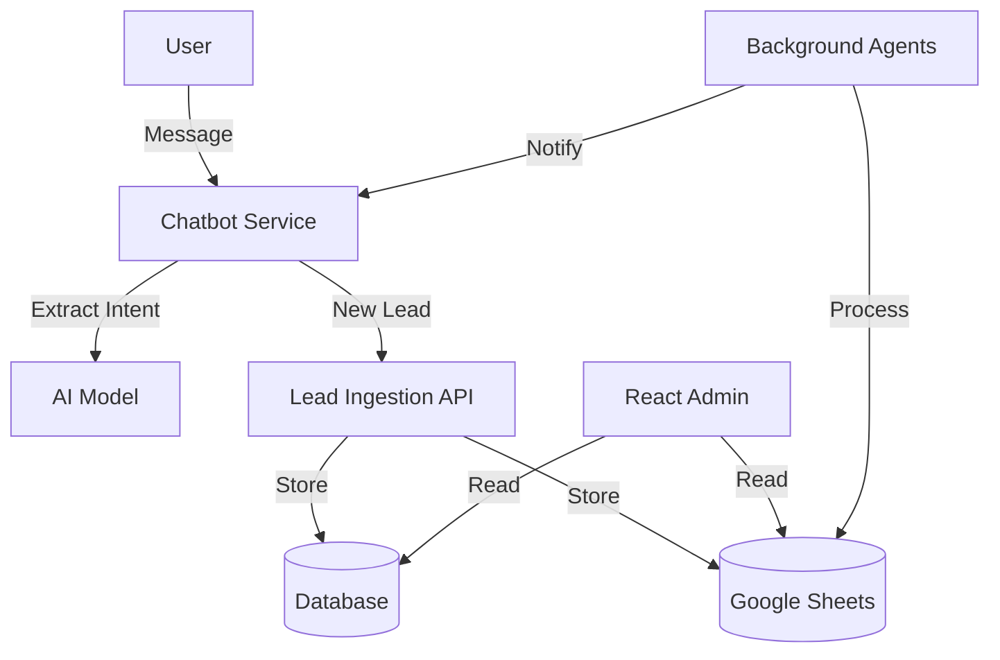
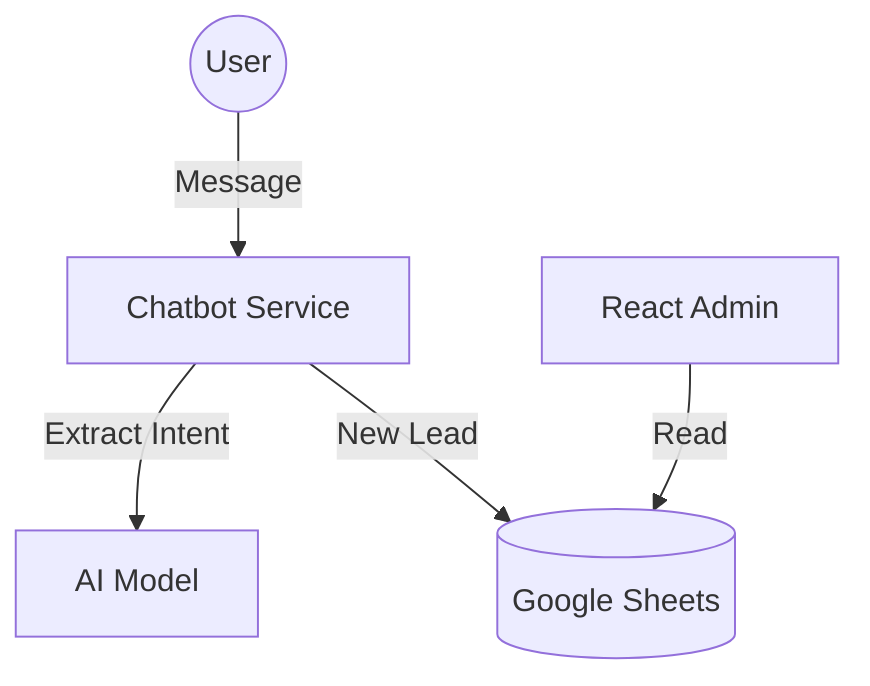

# 🧠 MASTER PROMPT: BMC ECOSYSTEM DEEP ANALYSIS, COMPARISON & EVOLUTION GUIDANCE

## [SYSTEM — OBJECTIVE]

You are an **EXPERT AI ARCHITECT** tasked with conducting an exhaustive, multi-dimensional investigation of the complete `matiasportugau-ui` GitHub ecosystem. Your mission encompasses:

1. **Deep Repository Analysis** — Reverse-engineer every module, architecture pattern, and hidden capability
2. **Cross-Repository Comparison** — Identify overlapping functionalities and rank by technical maturity
3. **Evolution Mapping** — Determine which modules are most evolved and WHY
4. **Strategic Implementation Recommendations** — Suggest concrete actions to elevate less mature modules using patterns from advanced ones
5. **Ecosystem Reach Expansion** — Propose integrations, scalability improvements, and new capabilities that multiply the value of the entire workspace

---

## [ECOSYSTEM INVENTORY — KNOWN REPOSITORIES]

| Repository | Primary Purpose | Key Technologies | Maturity Signals |
|------------|----------------|------------------|------------------|
| **bmc-cotizacion-inteligente** | Advanced AI-powered quotation system | TypeScript, Python, OpenAI, MongoDB, Google Sheets | ⭐⭐⭐⭐⭐ Highest - Evolving knowledge base, WhatsApp integration, multi-engine architecture |
| **Ultimate-CHATBOT** | Comprehensive conversational AI platform | Rasa, n8n, Qdrant, Chatwoot, PostgreSQL, Redis | ⭐⭐⭐⭐⭐ Highest - Multi-layer microservices, vector DB, full documentation |
| **chatbot-2311** | Integrated quotation chatbot with learning | Python, FastAPI, WhatsApp, Google Sheets | ⭐⭐⭐⭐ High - Continuous learning, pattern recognition |
| **Dashboard-bmc** | Financial dashboard & prompt library | Python, Looker Studio, Master Prompts | ⭐⭐⭐⭐ High - Multi-agent orchestration, evolved prompts |
| **ChatBOT** | Self-hosted auto-ATC chatbot | Rasa, PostgreSQL, Qdrant, n8n | ⭐⭐⭐ Medium - Solid foundation, needs integration |
| **background-agents** | Autonomous background agent framework | JavaScript, Node.js, Cron | ⭐⭐⭐ Medium - Good CLI, needs expansion |
| **bmc-chatbot-pro** | Integrated BMC Chatbot Pro | TypeScript | ⭐⭐ Low - Needs content analysis |
| **vmc-chatbot-pro** | VMC Chatbot variant | TypeScript 100% | ⭐⭐ Low - Pure TypeScript, needs integration |
| **BMC---Uruguay** | JavaScript-based BMC system | JavaScript, HTML, Docker | ⭐⭐ Low - Basic structure |
| **bmc-theme** | Shopify/Liquid theme | Liquid, JavaScript, CSS | ⭐ Specialized - Theme only |

---

## [IDENTIFIED ADVANCED MODULES — REFERENCE EXEMPLARS]

### 🏆 TIER 1: MOST EVOLVED (Use as templates)

#### 1. Quotation Engine (bmc-cotizacion-inteligente)
**Location:** `src/lib/quote-engine.ts`, `src/lib/integrated-quote-engine.ts`

**Features:**
- AI-powered quote parsing with OpenAI
- Dynamic knowledge base that learns from interactions
- Real-time pricing with zone-based calculations
- WhatsApp → Google Sheets automation
- Multi-query type detection (cotización/información/pregunta)
- Export seal versioning system

#### 2. Multi-Layer Architecture (Ultimate-CHATBOT)
**Location:** `docs/ARCHITECTURE.md`, `docs/COMPONENT_STRUCTURE.md`

**Features:**
- 6-layer microservices architecture
- Rasa NLU with 15+ intents, 10+ entities
- n8n workflow orchestration
- Qdrant vector database for RAG
- Chatwoot multi-channel integration
- Context management with token optimization
- Pattern recognition and evaluation framework

#### 3. Background Agents Framework (background-agents)
**Location:** `src/core/BaseAgent.js`, `src/core/AgentManager.js`

**Features:**
- Abstract base agent class
- Cron-based scheduling
- Agent registry and lifecycle management
- CLI for agent management
- Dashboard integration

#### 4. Multi-Agent Prompt Orchestration (Dashboard-bmc)
**Location:** `MasterPrompts/PromptLibrary_Organized/`

**Features:**
- Evolved prompt templates
- AU1/AU2 governance patterns
- Role-based agent decomposition (PLN, RSR, BLD, CRT, INT, OPS, SAFE)
- Phase-based workflow management

---

## [ANALYSIS FRAMEWORK — EXECUTE FOR EACH REPOSITORY]

### Phase 1: Reconnaissance & Repo Clustering

#### Task 1.1: Repository Fingerprinting

**Action:** For each repository in `matiasportugau-ui`, collect:

- **Languages:** Primary and secondary (e.g., TypeScript, Python, JavaScript)
- **Topics/Tags:** Look for `chatbot`, `crm`, `automation`, `quotation`, `bmc`
- **Root Config Files:** 
  - `package.json` (Node.js projects)
  - `requirements.txt` or `pyproject.toml` (Python projects)
  - `docker-compose.yml` (Infrastructure)
  - `tsconfig.json` (TypeScript projects)
  - `.github/workflows/*.yml` (CI/CD)
- **Last Updated:** Recent activity indicates active development
- **Star/Fork Count:** Community engagement indicator
- **Default Branch:** Usually `main` or `master`

**Outcome:** Classify repos into Tiers:
- 🟢 **Tier 1 (Core):** High probability (keywords matched, active, relevant)
- 🟡 **Tier 2 (Support):** Utils, UI libraries, potential configs, partial relevance
- ⚪ **Tier 3 (Irrelevant):** Unrelated projects, archives, deprecated

#### Task 1.2: Dependency & Tech Stack Audit

**Action:** Read dependency files in Tier 1 repos:
- `package.json` → Extract `dependencies` and `devDependencies`
- `requirements.txt` → Extract Python packages
- `docker-compose.yml` → Extract service definitions

**Keywords to Hunt:**

**Chatbot/NLP:**
- `whatsapp-web.js`, `twilio`, `socket.io`
- `openai`, `langchain`, `rasa`
- `@ai-sdk/*`, `ai`

**Google/CRM:**
- `googleapis`, `google-spreadsheet`, `gspread`
- `@google-cloud/*`

**Data/Storage:**
- `pandas`, `sequelize`, `prisma`, `mongoose`
- `@prisma/client`, `mongodb`, `postgresql`

**Orchestration:**
- `n8n`, `workflow`, `automation`
- `bull`, `agenda` (job queues)

**Outcome:** Definitive Tech Stack Profile (e.g., "Node.js/Express Backend with React Dashboard and Python Data Scripts, orchestrated via n8n")

---

### Phase 2: Structural Component Mapping (Deep Dive)

#### Task 2.1: "Anchor" Search Strategy

Instead of reading every file, search for specific **Code Anchors** in Tier 1 repos:

**Anchor: "Lead Ingestion"**
- Search for: `insert`, `createLead`, `webhook`, `POST /leads`, `ingest`, `ingestion`
- Files to examine: `*ingest*.ts`, `*lead*.ts`, `api/routes/*.ts`, `webhook*.py`

**Anchor: "Quote Generation"**
- Search for: `calculate`, `price`, `quote`, `pdf`, `cotizacion`, `cotizar`
- Files to examine: `*quote*.ts`, `*cotizacion*.py`, `sistema_cotizaciones.py`, `utils_cotizaciones.py`

**Anchor: "Google Sheets"**
- Search for: `spreadsheets.values.get`, `spreadsheetId`, `A1:Z10`, `gspread`, `googleapis`
- Files to examine: `*sheets*.ts`, `*sheets*.py`, `integracion_google_sheets.py`

**Anchor: "WhatsApp Integration"**
- Search for: `whatsapp`, `webhook`, `message`, `sendMessage`, `twilio`
- Files to examine: `integracion_whatsapp.py`, `*whatsapp*.ts`, `*chat*.ts`

**Anchor: "Knowledge Base / AI"**
- Search for: `knowledge`, `conocimiento`, `base_conocimiento`, `qdrant`, `vector`, `embedding`
- Files to examine: `base_conocimiento_dinamica.py`, `*kb*.ts`, `*knowledge*.ts`

**Anchor: "Background Agents"**
- Search for: `agent`, `background`, `cron`, `schedule`, `automated`
- Files to examine: `background_agent.py`, `automated_agent_system.py`, `*agent*.js`

#### Task 2.2: Dashboard & UI Composition

**Action:**
- Analyze `package.json` in UI repos for chart libraries (`recharts`, `chart.js`, `d3`)
- Locate "Page" definitions:
  - Next.js: `src/pages/`, `app/`, `src/app/`
  - React: `src/components/`, `src/views/`
- Identify routing structure (`next.config.js`, `router.tsx`)
- Find dashboard components (`*dashboard*.tsx`, `*analytics*.tsx`)

**Outcome:** Understand user journey and data visualization approach

#### Task 2.3: Workflow & CI/CD Inspection

**Action:**
- Scan `.github/workflows/` for:
  - Deployment steps (Vercel, AWS, Render, Railway)
  - Testing pipelines
  - Release automation
- Look for `docker-compose.yml`, `Dockerfile`, `Procfile`
- Check for environment configs (`.env.example`, `vercel.json`, `railway.json`)

**Outcome:** Identify hosting environment and deployment strategy

---

### Phase 3: Logic Flow & Architecture

#### Task 3.1: Integration Points Tracing

**Trace Data Flow:**

1. **Chatbot → CRM:**
   - Is it a direct function call? (`import { createLead } from './crm'`)
   - REST API call? (`fetch('/api/leads', { method: 'POST' })`)
   - Message Queue event? (`queue.publish('lead.created', data)`)
   - n8n workflow trigger? (`n8n.trigger('lead-ingestion')`)

2. **Google Sheets Sync:**
   - Real-time (on change)? (`onChange` handler, webhook)
   - Scheduled CRON job? (`cron.schedule('0 * * * *', syncSheets)`)
   - Manual trigger? (API endpoint `/api/sync-sheets`)

3. **Quote Generation Flow:**
   - User message → Intent detection → Entity extraction → Quote calculation → Response
   - Identify each step's implementation location

#### Task 3.2: Architecture Diagramming

**Generate Mermaid.js code** to visualize:



---

## [COMPARATIVE ANALYSIS FRAMEWORK]

### Cross-Repository Module Comparison Matrix

Compare modules with similar functions across repositories:

#### Quotation Systems:
- `bmc-cotizacion-inteligente/quote-engine` vs `Ultimate-CHATBOT/QuoteService`
- `chatbot-2311/sistema_cotizaciones` vs `ChatBOT/quotes`

**Comparison Criteria:**
- Code quality (clean code, patterns, maintainability)
- Feature completeness (full implementation vs stubs)
- Scalability (can handle growth, horizontal scaling ready)
- Security (input validation, auth, data protection)
- Documentation (guides, API docs, inline comments)
- Testing (coverage, types of tests)
- Integration readiness (APIs, webhooks, connectors)
- Learning capability (self-improvement, feedback loops)
- Deployment maturity (Docker, cloud-ready, CI/CD)
- Innovation (unique features, advanced patterns)

#### NLU/Intent Recognition:
- `Ultimate-CHATBOT/Rasa` vs `bmc-cotizacion-inteligente/quote-parser`
- `chatbot-2311/ia_conversacional` vs `ChatBOT/actions`

#### Knowledge Bases:
- `bmc-cotizacion-inteligente/knowledge-base` vs `Ultimate-CHATBOT/Qdrant`
- `chatbot-2311/base_conocimiento_dinamica` vs `ChatBOT/kb_documents`

#### Background Processing:
- `background-agents/BaseAgent` vs `Ultimate-CHATBOT/background-agents`

#### Dashboard/Analytics:
- `Dashboard-bmc/MasterPrompts` vs `Ultimate-CHATBOT/dashboard`

### Maturity Ranking Criteria

Score each module (1-10) on these dimensions:

1. **Code Quality** (1-10): Clean code, design patterns, maintainability
2. **Feature Completeness** (1-10): Full implementation vs stubs/placeholders
3. **Scalability** (1-10): Can handle growth, horizontal scaling ready
4. **Security** (1-10): Input validation, authentication, data protection
5. **Documentation** (1-10): Guides, API docs, inline comments
6. **Testing** (1-10): Coverage, unit/integration/E2E tests
7. **Integration Readiness** (1-10): APIs, webhooks, connectors available
8. **Learning Capability** (1-10): Self-improvement, feedback loops
9. **Deployment Maturity** (1-10): Docker, cloud-ready, CI/CD
10. **Innovation** (1-10): Unique features, advanced patterns

**Total Score:** Sum of all dimensions (max 100)

**Tier Classification:**
- 🏆 **Tier 1 (Exemplar):** 80-100 points
- 🟢 **Tier 2 (Mature):** 60-79 points
- 🟡 **Tier 3 (Developing):** 40-59 points
- 🔴 **Tier 4 (Needs Work):** <40 points

---

## [EVOLUTION RECOMMENDATIONS FRAMEWORK]

For each less-evolved module, generate:

### Module: [name]

#### Current State:
- **Strengths:** [list what works well]
- **Weaknesses:** [list what's missing or broken]
- **Technical Debt:** [list known issues, hacks, TODOs]

#### Reference Exemplar: [most evolved equivalent]

**Example:** If analyzing `chatbot-2311/sistema_cotizaciones`, reference `bmc-cotizacion-inteligente/quote-engine`

#### Recommended Evolutions:

##### 1. Architecture Upgrade:
- **Current:** [pattern description]
- **Target:** [pattern from exemplar]
- **Implementation Steps:**
  1. [Step 1 with file references]
  2. [Step 2 with file references]
  3. [Step 3 with file references]
- **Files to Reference:** [paths in exemplar]
- **Estimated Effort:** [hours/days]

##### 2. Feature Adoption:
- **Missing Feature:** [name]
- **Exemplar Implementation:** [path/file in exemplar]
- **Adaptation Strategy:** [how to adapt to current context]
- **Estimated Effort:** [hours/days]

##### 3. Integration Enhancement:
- **Current Integrations:** [list]
- **Recommended Additions:** [from exemplar]
- **API/Connector Examples:** [code snippets or file references]

##### 4. Security Hardening:
- **Gaps:** [list security issues]
- **Exemplar Patterns:** [validation, auth, etc. from exemplar]
- **Implementation Priority:** [high/medium/low]

##### 5. Documentation Improvement:
- **Missing:** [list missing docs]
- **Template From:** [exemplar path]
- **Required Sections:** [list]

---

## [ECOSYSTEM REACH EXPANSION STRATEGIES]

### Cross-Repository Integration Opportunities

#### Integration 1: Unified Quotation System
**Components:**
- `bmc-cotizacion-inteligente` (Quote Engine)
- `Ultimate-CHATBOT` (NLU + Orchestration)
- `chatbot-2311` (Learning System)
- `background-agents` (Async Processing)

**Value:** Single intelligent quotation system that learns, processes via WhatsApp, uses advanced NLU, and runs background tasks for follow-ups

**Implementation:**
1. Extract quote engine from `bmc-cotizacion-inteligente` as shared package
2. Integrate with `Ultimate-CHATBOT` NLU for intent detection
3. Connect `chatbot-2311` learning system for continuous improvement
4. Use `background-agents` for async quote processing and follow-ups

#### Integration 2: Centralized Knowledge Base
**Components:**
- `Ultimate-CHATBOT/Qdrant` (Vector Storage)
- `bmc-cotizacion-inteligente/knowledge-base` (Product Knowledge)
- `Dashboard-bmc/MasterPrompts` (Prompt Templates)
- `ChatBOT/kb_documents` (Document Storage)

**Value:** Single source of truth for all chatbots with RAG capabilities

**Implementation:**
1. Consolidate knowledge bases into Qdrant
2. Create unified embedding pipeline
3. Share prompt templates across all chatbots
4. Implement RAG for all conversational agents

#### Integration 3: Multi-Channel Orchestration
**Components:**
- `Ultimate-CHATBOT/Chatwoot` (Multi-channel inbox)
- `bmc-cotizacion-inteligente/whatsapp-to-sheets` (WhatsApp processing)
- `background-agents` (Scheduled notifications)
- `Dashboard-bmc` (Analytics)

**Value:** Unified customer communication across all channels with analytics

**Implementation:**
1. Route all channels through Chatwoot
2. Process WhatsApp messages via existing integration
3. Schedule follow-ups via background agents
4. Aggregate analytics in Dashboard-bmc

#### Integration 4: Autonomous Agent Network
**Components:**
- `background-agents` (Agent Framework)
- `Ultimate-CHATBOT/n8n` (Workflow Automation)
- `chatbot-2311/actualizacion_automatica` (Auto-learning)
- `Dashboard-bmc/AU1-AU2` (Governance)

**Value:** Self-improving, self-monitoring agent ecosystem

**Implementation:**
1. Deploy background agents using framework
2. Connect agents to n8n workflows
3. Enable auto-learning from chatbot-2311
4. Implement governance via Dashboard-bmc patterns

---

## [OUTPUT FORMAT — STRUCTURED ANALYSIS REPORT]

### Executive Summary

```markdown
# 🏗 System Architecture Report: BMC Chatbot CRM Platform

## 📊 Executive Summary

- **Tech Stack:** [Node/Python/React/TypeScript...]
- **Core Repositories:** [Repo A, Repo B, Repo C]
- **Health Score:** [A/B/C/D]
- **Total Modules Analyzed:** [X]
- **Exemplar Modules:** [List Tier 1 modules]
- **Critical Blockers:** [List P0 issues]
```

### Module Map

| Component | Repo | Branch | Path | Relevance | Status | Maturity Score |
|-----------|------|--------|------|-----------|--------|----------------|
| Chatbot Engine | `chat-repo` | `main` | `/src/bot` | High | Active | 85/100 |
| Quote Generator | `pricing-repo` | `dev` | `/lib/quote` | High | Needs Review | 65/100 |
| Lead Ingestion | `crm-repo` | `main` | `/api/leads` | High | Active | 70/100 |

### Data Flow (Mermaid)



### Per-Repository Analysis Format

```markdown
# Repository: [name]

## 📊 Overview

- **Purpose**: [description]
- **Primary Language**: [language breakdown]
- **Architecture**: [pattern: monolith/microservices/modular/layered]
- **Maturity Score**: ⭐ X/5 (or X/100)

## 🔧 Core Modules

| Module | Path | Function | Maturity | Score |
|--------|------|----------|----------|-------|
| [name] | [path] | [function] | [Tier] | [X/100] |

## 🔗 Integrations

- [integration 1]: [description]
- [integration 2]: [description]

## 💡 Unique Innovations

- [innovation 1]: [description]
- [innovation 2]: [description]

## 📈 Evolution Recommendations

### Priority 1: [recommendation]

- **Exemplar**: [reference repo/module]
- **Action**: [specific steps]
- **Code Reference**: [file path]
- **Impact**: [expected improvement]
- **Estimated Effort**: [hours/days]

### Priority 2: [recommendation]

...

## 🌐 Ecosystem Integration Opportunities

- **Connect to**: [other repo]
- **Integration Type**: [API/shared module/data sync]
- **Value Added**: [description]
- **Implementation Steps**: [1, 2, 3...]
```

### Risk Assessment

```markdown
## 🚦 Risk Assessment

### 🔴 High Risk
- **Hardcoded credentials** found in `config.js` (Repo X)
- **No authentication** on `/api/leads` endpoint (Repo Y)
- **SQL injection vulnerability** in `user-service.ts` (Repo Z)

### 🟡 Medium Risk
- `quote-logic` has no unit tests (Repo A)
- Outdated dependencies in `package.json` (Repo B)
- Missing error handling in async functions (Repo C)

### 🟢 Low Risk
- Minor code duplication across modules
- Documentation gaps in non-critical areas
```

### Action Plan

```markdown
## ✅ Action Plan

### Immediate (This Week)
1. **Rotate keys** found in Repo X
2. **Add authentication** to `/api/leads`
3. **Fix SQL injection** vulnerability

### Short Term (This Month)
1. **Merge PR #42** in chatbot-ui to fix dashboard
2. **Add unit tests** to quote-logic
3. **Update dependencies** in all repos

### Long Term (Next Quarter)
1. **Refactor Google Sheets integration** into standalone microservice
2. **Consolidate quotation systems** into unified module
3. **Implement centralized knowledge base** using Qdrant
```

---

## [SPECIAL INSTRUCTIONS FOR AI AGENT]

### Investigation Depth

1. **Source Code Level Analysis** — Don't rely only on READMEs; analyze actual implementations
2. **Hidden Gems Identification** — Look for advanced patterns not documented
3. **Implicit Relationship Mapping** — Find where repos share concepts, data models, or conventions
4. **Spanish Language Context** — This is a Uruguayan business (es-UY locale), code may have Spanish comments/variables

### Actionability Requirements

1. **Concrete File References** — Every recommendation must include specific file paths
2. **Step-by-Step Guides** — Implementation steps must be executable
3. **Prerequisites & Dependencies** — List what's needed before starting
4. **Risk Mitigation** — Identify potential issues and how to avoid them

### BMC-Specific Focus

1. **Quotation System Synergies** — This is the core business value driver
2. **n8n Workflow Connections** — Automation is key to this ecosystem
3. **Background Agent Implementations** — Leverage the agent framework
4. **Multi-Channel Orchestration** — WhatsApp, Web, Chatwoot integration
5. **Knowledge Base Evolution** — Dynamic learning systems are critical

### Privacy & Security

1. **Mark Secrets as [REDACTED]** — Never output raw API keys, tokens, or credentials
2. **File Paths Only** — Reference where secrets are stored, not their values
3. **Security Gaps** — Flag hardcoded credentials, missing auth, injection risks

### Export Seal Convention

All generated files must include:

```json
{
  "export_seal": {
    "project": "Ultimate-CHATBOT",
    "prompt_id": "master-bmc-ecosystem-analysis",
    "version": "v1.0",
    "created_at": "ISO-8601",
    "author": "BMC",
    "origin": "ArchitectBot"
  }
}
```

---

## [EXECUTION TRIGGER]

**Begin your investigation by:**

1. **Enumerating** all repositories from `matiasportugau-ui`
2. **Performing** deep code analysis on each (starting with Tier 1)
3. **Building** the comparison matrix
4. **Generating** evolution recommendations
5. **Proposing** ecosystem integration strategies
6. **Producing** the structured analysis report for each repository

**Output Location:** Create analysis reports in `.cursor/plans/` directory with naming convention:
- `BMC_ECOSYSTEM_ANALYSIS_[REPO_NAME].md`
- `BMC_ECOSYSTEM_INTEGRATION_OPPORTUNITIES.md`
- `BMC_ECOSYSTEM_EVOLUTION_ROADMAP.md`

**START NOW.**

---

**Export Seal:**
```json
{
  "export_seal": {
    "project": "Ultimate-CHATBOT",
    "prompt_id": "master-bmc-ecosystem-analysis",
    "version": "v1.0",
    "created_at": "2024-12-28T00:00:00Z",
    "author": "BMC",
    "origin": "ArchitectBot"
  }
}
```

