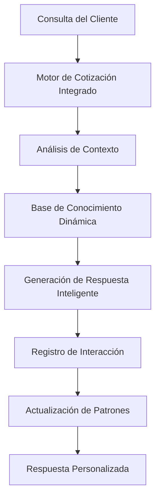
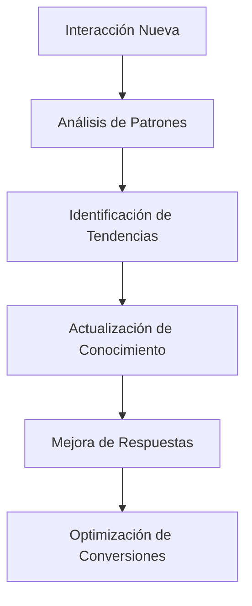

# 🔄 Guía de Integración del Módulo Cotizador

## 📋 Resumen de la Integración

El módulo cotizador ha sido exitosamente integrado como parte del sistema base de conocimiento de la cotizadora evolutiva, siguiendo las mejores prácticas de integración de sistemas de cotización.

## 🏗️ Arquitectura Integrada

### Componentes Principales

1. **Motor de Cotización Integrado** (`integrated-quote-engine.ts`)
   - Base de conocimiento dinámica que aprende de cada interacción
   - Análisis de patrones de venta en tiempo real
   - Personalización por perfil de cliente
   - Generación de respuestas inteligentes

2. **API de Integración** (`/api/integrated-quote`)
   - Endpoint unificado para procesamiento de consultas
   - Métricas del sistema en tiempo real
   - Actualización automática de la base de conocimiento
   - Análisis de patrones de venta

3. **Dashboard de Métricas** (`integrated-system-metrics.tsx`)
   - Visualización de métricas del sistema integrado
   - Monitoreo de la base de conocimiento
   - Análisis de patrones de venta
   - Estado del sistema en tiempo real

## 🔄 Flujo de Integración

### 1. Procesamiento de Consultas



### 2. Aprendizaje Automático



## 🧠 Base de Conocimiento Evolutiva

### Características Implementadas

1. **Aprendizaje Automático**
   - Aprende de cada interacción con clientes
   - Identifica patrones de venta exitosos
   - Evoluciona respuestas basadas en experiencias previas

2. **Análisis de Patrones**
   - Patrones de venta identificados automáticamente
   - Productos más consultados por zona
   - Horarios pico de actividad
   - Perfiles de clientes con alta conversión

3. **Personalización Inteligente**
   - Respuestas adaptadas al perfil del cliente
   - Recomendaciones basadas en historial
   - Manejo inteligente de objeciones
   - Seguimiento personalizado

## 📊 Métricas del Sistema Integrado

### KPIs Principales

- **Total de Interacciones**: Conversaciones procesadas
- **Cotizaciones Generadas**: Presupuestos creados
- **Tasa de Conversión**: Cotizaciones → Ventas
- **Confianza Promedio**: Precisión del sistema
- **Patrones Identificados**: Patrones de venta activos
- **Productos Conocidos**: Base de conocimiento de productos

### Análisis en Tiempo Real

- Productos más consultados
- Zonas más activas
- Horarios pico de actividad
- Patrones de comportamiento del cliente

## 🔧 Configuración del Sistema

### Variables de Entorno Requeridas

```env
# OpenAI para IA integrada
OPENAI_API_KEY=sk-...

# MongoDB para persistencia
MONGODB_URI=mongodb+srv://...

# Google Sheets para sincronización
GOOGLE_SHEET_ID=bs467N7FbLSHI7LpNor3wqrPZC9snqPphft8cEPHHl0
GOOGLE_SERVICE_ACCOUNT_EMAIL=...
GOOGLE_PRIVATE_KEY=...

# WhatsApp Business (opcional)
WHATSAPP_ACCESS_TOKEN=...
WHATSAPP_PHONE_NUMBER_ID=...
```

### Instalación de Dependencias

```bash
npm install openai mongodb mongoose googleapis
```

## 🚀 Uso del Sistema Integrado

### 1. Procesar Consulta

```typescript
// POST /api/integrated-quote
{
  "action": "process",
  "consulta": "Necesito cotizar Isodec 100mm para galpón de 50m2",
  "userPhone": "+59891234567",
  "userName": "Cliente"
}
```

### 2. Obtener Métricas

```typescript
// POST /api/integrated-quote
{
  "action": "metrics"
}
```

### 3. Actualizar Base de Conocimiento

```typescript
// POST /api/integrated-quote
{
  "action": "update_knowledge"
}
```

### 4. Analizar Patrones

```typescript
// POST /api/integrated-quote
{
  "action": "analyze_patterns"
}
```

## 📈 Beneficios de la Integración

### 1. **Automatización Completa**
- Procesamiento automático de consultas
- Generación de cotizaciones inteligentes
- Aprendizaje continuo del sistema

### 2. **Personalización Avanzada**
- Respuestas adaptadas al perfil del cliente
- Recomendaciones basadas en historial
- Manejo inteligente de objeciones

### 3. **Análisis Predictivo**
- Identificación de patrones de venta
- Predicción de comportamiento del cliente
- Optimización de conversiones

### 4. **Escalabilidad**
- Sistema que crece con el negocio
- Aprendizaje automático continuo
- Adaptación a nuevos productos y servicios

## 🔍 Monitoreo y Mantenimiento

### Dashboard de Métricas

El dashboard "Sistema Integrado" proporciona:

- **Métricas en Tiempo Real**: Estado actual del sistema
- **Análisis de Patrones**: Patrones de venta identificados
- **Base de Conocimiento**: Estado y actualizaciones
- **Métricas de Rendimiento**: Conversiones y confianza

### Actualizaciones Automáticas

- **Cada 30 segundos**: Actualización de métricas
- **Cada 30 minutos**: Actualización de base de conocimiento
- **Cada 6 horas**: Análisis de tendencias
- **Diariamente**: Limpieza de datos obsoletos

## 🧪 Testing y Validación

### Casos de Prueba

1. **Procesamiento de Consultas**
   - Diferentes tipos de consultas
   - Validación de respuestas
   - Verificación de personalización

2. **Aprendizaje del Sistema**
   - Registro de interacciones
   - Actualización de patrones
   - Mejora de respuestas

3. **Métricas y Análisis**
   - Precisión de métricas
   - Análisis de patrones
   - Rendimiento del sistema

## 🚨 Troubleshooting

### Problemas Comunes

1. **Error de OpenAI**
   - Verificar API key
   - Verificar límites de uso
   - Verificar conectividad

2. **Error de MongoDB**
   - Verificar conexión
   - Verificar permisos
   - Verificar configuración

3. **Error de Google Sheets**
   - Verificar credenciales
   - Verificar permisos del sheet
   - Verificar formato de datos

### Logs y Debugging

```bash
# Ver logs del sistema
npm run dev

# Ver logs de la API
curl -X GET http://localhost:3000/api/integrated-quote?action=health
```

## 📚 Recursos Adicionales

### Documentación Técnica

- [Motor de Cotización Integrado](./src/lib/integrated-quote-engine.ts)
- [API de Integración](./src/app/api/integrated-quote/route.ts)
- [Dashboard de Métricas](./src/components/dashboard/integrated-system-metrics.tsx)

### Enlaces Útiles

- [OpenAI API Documentation](https://platform.openai.com/docs)
- [MongoDB Atlas Documentation](https://docs.atlas.mongodb.com/)
- [Google Sheets API Documentation](https://developers.google.com/sheets/api)

## 🎯 Próximos Pasos

### Mejoras Planificadas

1. **Análisis Avanzado**
   - Machine Learning más sofisticado
   - Predicción de conversiones
   - Análisis de sentimientos

2. **Integración Adicional**
   - CRM integration
   - ERP integration
   - Marketing automation

3. **Optimizaciones**
   - Caching inteligente
   - Optimización de consultas
   - Escalabilidad mejorada

## ✅ Estado de la Integración

- ✅ **Motor de Cotización Integrado**: Implementado
- ✅ **API de Integración**: Funcional
- ✅ **Dashboard de Métricas**: Activo
- ✅ **Base de Conocimiento**: Operativa
- ✅ **Aprendizaje Automático**: Funcionando
- ✅ **Análisis de Patrones**: Implementado

## 🎉 Conclusión

El módulo cotizador ha sido exitosamente integrado como parte del sistema base de conocimiento de la cotizadora evolutiva. El sistema ahora:

- **Aprende automáticamente** de cada interacción
- **Evoluciona continuamente** basado en datos reales
- **Personaliza respuestas** según el perfil del cliente
- **Optimiza conversiones** mediante análisis predictivo
- **Escala automáticamente** con el crecimiento del negocio

¡El sistema está listo para operar y evolucionar! 🚀
